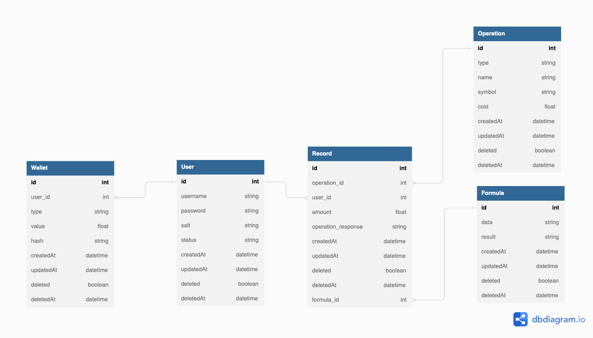

# Setup

### Requirements
- Docker

### Technologies Used:

Node.js: The API was developed using Node.js with the Express framework.

Database: The data is stored and persisted using Postgres, leveraging Prisma as the ORM.

Caching: In certain scenarios, a cache layer is implemented using Redis, utilizing the ioredis library.

Testing: The project includes tests implemented with Jest.

### Structure

The project is structured as follows:
  - root
    - routes
    - modules
        - module_name
            - tests
            - routes
            - actions
            - helpers
    - utils
        - redis.js
        - prisma.js
        - cache.js
        ...


### Setup .env

To configure the application properly, you need to create two environment files: ".env" and ".env.local". The ".env" file should be used with Docker Compose, while the ".env.local" file is meant for running the application locally.

Make sure to create these files in the root directory of the project and populate them with the following variables:

- JWT_SECRET: Secret used for JWT token signing.
- RANDOM_ORG_API_KEY: API key obtained from random_org.

Assign appropriate values to these variables in their respective files to ensure the application runs correctly.

### Start the containers

The following command will initiate the startup process for all containers within the same network:
The included containers are:

-  Redis Server
-  Postgres Server
-  API

```sh
docker-compose up
```

To run the Node.js app locally with the Redis and PostgreSQL containers, use the following commands:

```sh
# Start PostgreSQL and Redis containers without the Node.js app
docker-compose -f docker-compose.local.yml up
```

```sh
# Load the correct env file (env.local) and start the Node.js app locally
npm install && NODE_ENV=local npx ts-node src/api.ts
```

Also if you are using VScode you can debug the application by choosing the application `Debug API` and pressing F5.

# Database


# Endpoints
To access the documentation, you can use the API endpoint "/docs" which will load a Swagger documentation.

Local
http://localhost:4000/docs


Server
http://ec2-34-238-119-22.compute-1.amazonaws.com:4000/docs


Additionally, it is possible to obtain an Insomnia collection named `collection.json` located in the /docs folder.

# Tests

Run unit tests
```sh
docker exec -it truenorth_api npm test
```